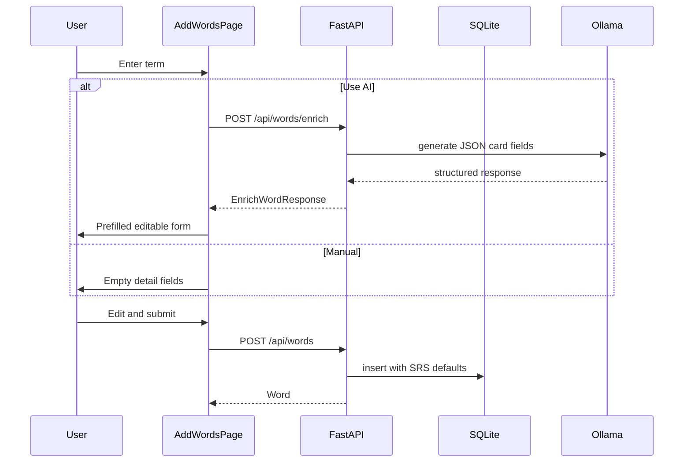

# Backend + Ollama Word Enrichment

## What we're building

| Layer | Deliverable |
|-------|-------------|
| Backend | FastAPI app on `:8000` matching [`frontend/src/api/contract.md`](frontend/src/api/contract.md) |
| Persistence | SQLite (single-user, file-based) |
| AI enrich | `POST /api/words/enrich` → Ollama at `http://localhost:11434` |
| Frontend | `AddWordsPage` + `WordForm` with **Fill with AI** or manual entry → `POST /api/words` |

The frontend already proxies `/api` → `http://localhost:8000` ([`frontend/vite.config.ts`](frontend/vite.config.ts)). No CORS changes needed when using the Vite proxy.



---

## Backend architecture

### Stack

- **Python 3.11+**, FastAPI, Uvicorn
- **SQLAlchemy 2** + **SQLite** (`backend/data/vocab.db`, gitignored)
- **Pydantic v2** schemas mirroring [`frontend/src/api/types.ts`](frontend/src/api/types.ts)
- **httpx** for Ollama HTTP calls
- **pytest** + **httpx** `TestClient` for API tests

### Layout

```
backend/
  pyproject.toml          # deps + scripts (uv or pip)
  .env.example            # OLLAMA_BASE_URL, OLLAMA_MODEL
  app/
    main.py               # FastAPI app, CORS (optional), router mount
    config.py             # Settings from env
    database.py           # engine, SessionLocal, Base
    models/word.py        # SQLAlchemy Word row
    schemas/word.py       # Word, CreateWordInput, ReviewPayload, EnrichWordRequest/Response
    services/
      srs.py              # port of frontend/src/srs/srs.ts logic
      ollama.py           # Ollama client + prompt + JSON parse/retry
    routers/words.py      # all /api/words routes
  tests/
    test_srs.py           # mirror cases from frontend/src/srs/srs.test.ts
    test_words_api.py     # CRUD + review + due ordering
    test_enrich.py        # mock Ollama responses
```

### Data model (`Word` table)

Columns map 1:1 to the frontend `Word` type:

- Content: `id` (UUID string), `term`, `part_of_speech`, `definition`, `synonyms` (JSON array), `example_sentence`
- SRS: `ease_factor` (default `2.5`), `interval_days` (0), `repetitions` (0), `next_review_at` (nullable datetime), `status` (default `'new'`)
- `created_at` for stable tie-breaking in due-queue sort

### SRS service (parity-critical)

Port [`frontend/src/srs/srs.ts`](frontend/src/srs/srs.ts) and constants from [`frontend/src/srs/constants.ts`](frontend/src/srs/constants.ts) into `backend/app/services/srs.py`:

- `compute_next_review(word, knew_it, now) -> SrsUpdate`
- `is_due(word, now) -> bool`
- `sort_by_urgency(words, now) -> list`

**Tests must copy the four `computeNextReview` cases and `sortByUrgency` case from [`frontend/src/srs/srs.test.ts`](frontend/src/srs/srs.test.ts)** using the same fixture values (`unnerve`, `now = 2026-06-16T12:00:00Z`). This guarantees backend/frontend scheduling parity.

### API endpoints

| Method | Path | Notes |
|--------|------|-------|
| `GET` | `/api/words` | All words (contract; optional for v1 UI) |
| `GET` | `/api/words/due?limit=20` | Filter `next_review_at IS NULL OR <= now`, sort via `sort_by_urgency`, slice to `limit` |
| `POST` | `/api/words` | Validate `CreateWordInput`, reject duplicate `term` (case-insensitive), init SRS defaults, return `Word` |
| `POST` | `/api/words/{id}/review` | Body `{ knew_it: bool }`, apply SRS, persist, return updated `Word` |
| `POST` | `/api/words/enrich` | **New** — body `{ term: string }`, returns suggested card fields (does not persist) |

**Error shape:** FastAPI `HTTPException` → `{ "detail": "..." }` (matches [`frontend/src/api/http.ts`](frontend/src/api/http.ts)).

#### `POST /api/words/enrich` (new contract extension)

Request:

```json
{ "term": "ephemeral" }
```

Response (`EnrichWordResponse` — same fields as `CreateWordInput`):

```json
{
  "term": "ephemeral",
  "part_of_speech": "adjective",
  "definition": "lasting a very short time",
  "synonyms": ["fleeting", "transient"],
  "example_sentence": "The ephemeral beauty of cherry blossoms draws crowds each spring."
}
```

Errors:

- `400` — empty/invalid term
- `503` — Ollama unreachable (`Connection refused`)
- `502` — Ollama returned unparseable JSON after one retry

Update [`frontend/src/api/contract.md`](frontend/src/api/contract.md) with this endpoint.

### Ollama integration (`backend/app/services/ollama.py`)

Config via env ([`.env.example`](backend/.env.example)):

```
OLLAMA_BASE_URL=http://localhost:11434
OLLAMA_MODEL=llama3.2
```

Implementation:

1. Call `POST {OLLAMA_BASE_URL}/api/generate` with `format: "json"` and a fixed system-style prompt asking for exactly: `part_of_speech`, `definition`, `synonyms` (array of 2–4 strings), `example_sentence` (one natural sentence using the word).
2. Parse JSON; validate with Pydantic; normalize `part_of_speech` to lowercase.
3. On parse failure, retry once with a stricter “JSON only, no markdown” prompt.
4. Never auto-save — enrichment is read-only until the user submits `POST /api/words`.

---

## Frontend changes (Add Words + AI)

The Add Words slice from the frontend plan is not built yet (no `WordForm` / `AddWordsPage`). Implement alongside backend:

### New API client

In [`frontend/src/api/types.ts`](frontend/src/api/types.ts):

```ts
export type EnrichWordRequest = { term: string }
export type EnrichWordResponse = CreateWordInput  // term echoed + filled fields
```

In [`frontend/src/api/wordsApi.ts`](frontend/src/api/wordsApi.ts):

```ts
export async function enrichWord(term: string): Promise<EnrichWordResponse>
// POST /api/words/enrich
```

Add tests in `wordsApi.test.ts` (mocked fetch).

### `WordForm` component

[`frontend/src/components/WordForm/WordForm.tsx`](frontend/src/components/WordForm/WordForm.tsx):

- **Term** input (required)
- **Fill with AI** button — calls `enrichWord(term)`, prefills `part_of_speech`, `definition`, `synonyms` (comma-separated display), `example_sentence`; shows loading spinner; surfaces `503` as “Start Ollama and pull a model” message
- All detail fields remain **editable** after AI fill
- **Save card** — calls `createWord`; required: term, part_of_speech, definition, example_sentence
- User can skip AI entirely and type everything manually

### `AddWordsPage` + routing

- [`frontend/src/pages/AddWordsPage.tsx`](frontend/src/pages/AddWordsPage.tsx) wraps `WordForm`, success message, link back to study
- Wire [`frontend/src/routes/AppRouter.tsx`](frontend/src/routes/AppRouter.tsx): `/` → `StudyPage`, `/add-words` → `AddWordsPage` (replace current nav-only [`frontend/src/App.tsx`](frontend/src/App.tsx) shell)
- `Layout` nav: Study | Add Words

TDD: follow existing project pattern (RED → GREEN → REFACTOR per slice) for `WordForm.test.tsx`, `AddWordsPage.test.tsx`, `wordsApi` enrich test.

---

## Dev workflow

```bash
# Terminal 1 — Ollama (user must have model pulled)
ollama pull llama3.2
ollama serve

# Terminal 2 — Backend
cd backend
python -m venv .venv && source .venv/bin/activate
pip install -e ".[dev]"
uvicorn app.main:app --reload --port 8000

# Terminal 3 — Frontend
cd frontend && npm run dev
```

Manual QA:

1. Open `http://localhost:5173/add-words`
2. Enter a word → **Fill with AI** → fields populate → edit if needed → Save
3. Enter another word manually (no AI) → Save
4. Study page loads both from `GET /api/words/due`

---

## Out of scope (v1)

- Auth / multi-user
- Streaming enrich responses (single JSON response is enough)
- Deck tiers, pronunciation audio
- Docker Compose (optional follow-up)
- Backend CI workflow (optional follow-up; frontend CI exists)

---

## Risks and mitigations

| Risk | Mitigation |
|------|------------|
| SRS drift between TS and Python | Shared test vectors from `srs.test.ts` |
| Ollama JSON quality varies by model | `format: "json"` + Pydantic validation + one retry; user always edits before save |
| Duplicate words | Backend rejects duplicate `term` with `409` |
| `StudyPage` not fully built yet | Backend is independently testable; study UI can land in a parallel slice using the same API |
