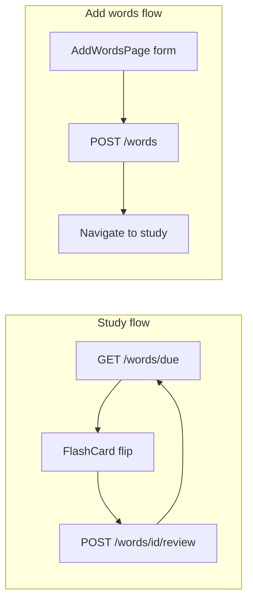

# Magoosh-Style Vocab Cards Frontend (TDD)

## Context

- Repo today: Vite 8 + React 19 + TypeScript scaffold only ([`frontend/`](frontend/)); no backend, no tests, no routing.
- Your choices: **frontend only** (you supply FastAPI) + **full SRS** (know/don't-know + rescheduling).
- Existing CSS tokens in [`frontend/src/index.css`](frontend/src/index.css) (`--accent`, light/dark) will be reused for card UI.

## Magoosh UX to replicate (v1)

| Behavior | Implementation |
|----------|----------------|
| Front of card | Word only, large type |
| Tap/click | Flip to back |
| Back of card | Part of speech, definition, synonyms, example sentence |
| After flip | "I know this word" / "Still learning" buttons |
| SRS | Words you know appear less often; unknown words resurface sooner |
| Progress | "Card X of Y" + count of words due today |
| Add words | Separate route with form to POST new cards into the deck |

Reference: Magoosh shows definition + example on flip; "I know this word" reduces frequency ([Magoosh Help Center](https://magoosh.zendesk.com/hc/en-us/articles/217412146-How-to-use-Flashcards-and-Reading-to-Improve-Vocabulary)).



---

## API contract (for your FastAPI backend)

The frontend will be developed against this contract using **MSW** in tests and a **Vite dev proxy** at runtime. Document this in a short `frontend/src/api/contract.md` (or inline in types) so backend implementation stays aligned.

### `Word` shape

```ts
type Word = {
  id: string
  term: string
  part_of_speech: string        // e.g. "verb"
  definition: string
  synonyms: string[]            // e.g. ["enervate", "faze"]
  example_sentence: string
  // SRS state (persisted by backend)
  ease_factor: number           // default 2.5
  interval_days: number         // default 0
  repetitions: number           // default 0
  next_review_at: string | null // ISO datetime; null = due now
  status: 'new' | 'learning' | 'review' | 'mastered'
}
```

### Endpoints

| Method | Path | Purpose |
|--------|------|---------|
| `GET` | `/api/words` | All words (for stats / fallback) |
| `GET` | `/api/words/due?limit=20` | Words where `next_review_at` is null or `<= now`, ordered by urgency |
| `POST` | `/api/words` | Create word; backend initializes SRS fields |
| `POST` | `/api/words/{id}/review` | Body: `{ knew_it: boolean }`; backend applies SRS update, returns updated `Word` |

**Create payload:**

```ts
type CreateWordInput = {
  term: string
  part_of_speech: string
  definition: string
  synonyms?: string[]
  example_sentence: string
}
```

**SRS algorithm (backend responsibility, tested via contract):** simplified SM-2 variant the frontend expects:

- `knew_it: false` → `status = 'learning'`, `interval_days = 0`, `next_review_at = now + 10 minutes`, `repetitions = 0`
- `knew_it: true` on new/learning → `repetitions += 1`, intervals `[1, 3, 7, 14, 30]` days by repetition count, `status` advances toward `mastered`
- `knew_it: true` on review → multiply interval by `ease_factor` (min 1.3), cap at 90 days
- Mastered words (`interval_days >= 30` and `repetitions >= 4`) get `status = 'mastered'` and longer intervals

Frontend will include a **pure `srs.ts` module** with the same rules (unit-tested) so you can verify backend parity during integration.

---

## Tech additions (frontend only)

Install into [`frontend/package.json`](frontend/package.json):

- `react-router-dom` — `/` study, `/add-words` add route
- `vitest`, `@vitest/coverage-v8`, `jsdom` — unit/integration tests
- `@testing-library/react`, `@testing-library/user-event`, `@testing-library/jest-dom` — component tests
- `msw` — mock API in tests (and optional dev mock mode)

New scripts: `"test": "vitest"`, `"test:run": "vitest run"`.

Config: [`frontend/vite.config.ts`](frontend/vite.config.ts) — add `test` block + proxy:

```ts
server: { proxy: { '/api': 'http://localhost:8000' } }
```

Env: `VITE_API_BASE_URL` (default `''` so proxy works in dev).

---

## Target file layout

```
frontend/src/
  api/
    types.ts          # Word, CreateWordInput, ReviewPayload
    wordsApi.ts       # fetch wrappers
    contract.md       # API spec for backend team
  srs/
    srs.ts            # pure scheduling helpers + next-interval logic
    srs.test.ts
  components/
    FlashCard/
      FlashCard.tsx
      FlashCard.test.tsx
      FlashCard.css
    StudyControls/
      StudyControls.tsx
      StudyControls.test.tsx
    WordForm/
      WordForm.tsx
      WordForm.test.tsx
    Layout/
      Layout.tsx      # nav: Study | Add Words
  pages/
    StudyPage.tsx
    StudyPage.test.tsx
    AddWordsPage.tsx
    AddWordsPage.test.tsx
  hooks/
    useStudySession.ts
    useStudySession.test.ts
  test/
    setup.ts          # jest-dom, MSW server lifecycle
    handlers.ts       # MSW route handlers
    fixtures.ts       # sample Word objects
  routes/
    AppRouter.tsx
  App.tsx             # replace Vite boilerplate
  main.tsx            # wrap with BrowserRouter
```

Remove broken `hero.png` import from current [`App.tsx`](frontend/src/App.tsx).

---

## TDD workflow (strict red → green → refactor)

Every slice follows this loop. **Do not skip ahead** — each stage ends with a checkpoint and waits for your explicit approval before continuing.

### Per-stage checkpoint (mandatory)

| Stage | What happens | Agent stops and asks you |
|-------|----------------|--------------------------|
| **RED** | Write failing test(s) describing **behavior** (not implementation). Run `npm run test:run` and confirm failure. | "RED complete for [slice/stage] — tests fail as expected. Proceed to GREEN?" |
| **GREEN** | Write the **minimum** code to make tests pass. Run `npm run test:run` and confirm all green. | "GREEN complete for [slice/stage] — tests pass. Proceed to REFACTOR?" |
| **REFACTOR** | Clean up (extract, rename, dedupe) without changing behavior. Run `npm run test:run` again. | "REFACTOR complete for [slice/stage]. Proceed to next slice?" |

**Rules:**

- One RED → GREEN → REFACTOR cycle per slice (or per logical sub-step within a slice if you prefer finer gates — default is per slice).
- Never start GREEN until you confirm RED.
- Never start REFACTOR until you confirm GREEN.
- Never start the next slice until you confirm REFACTOR.
- If you request changes at any checkpoint, address feedback and re-run tests before asking again.

Use **outside-in** for pages (MSW + RTL), **inside-out** for pure modules (`srs.ts`, `wordsApi.ts`).

---

## Vertical slices (implementation order)

### Slice 0 — Test harness

- **RED:** smoke test that `vitest` + RTL render `<App />`. → **checkpoint: ask before GREEN**
- **GREEN:** `test/setup.ts`, MSW `server.listen()`, vitest config in vite. → **checkpoint: ask before REFACTOR**
- **REFACTOR:** shared `renderWithRouter()` helper. → **checkpoint: ask before Slice 1**

### Slice 1 — API types + client

Tests in `wordsApi.test.ts` (fetch mocked):

- `getDueWords` calls `GET /api/words/due?limit=20` and returns typed array.
- `createWord` POSTs JSON body, throws on 4xx with message.
- `submitReview` POSTs `{ knew_it }`, returns updated word.

Implementation: `types.ts`, `wordsApi.ts` using `fetch` + `VITE_API_BASE_URL`.

### Slice 2 — SRS pure logic

Tests in `srs.test.ts`:

- `computeNextReview(knew_it: false)` resets to learning, short interval.
- `computeNextReview(knew_it: true)` steps through day intervals.
- `isDue(word, now)` respects `next_review_at`.
- `sortByUrgency(words)` puts overdue/new first.

Implementation: `srs.ts` — no React, no fetch.

### Slice 3 — FlashCard component

Tests:

- Renders `term` on front, hides back content.
- Click flips: shows `part_of_speech`, `definition`, comma-joined `synonyms`, `example_sentence`.
- Click again flips back.
- Keyboard: Enter/Space toggles flip (a11y).

Implementation: CSS 3D flip (`transform: rotateY`), `role="button"`, `aria-pressed` for flipped state.

### Slice 4 — StudyControls component

Tests:

- Buttons disabled until card is flipped.
- "I know this word" calls `onKnow`.
- "Still learning" calls `onLearning`.
- Shows progress `3 / 12`.

### Slice 5 — `useStudySession` hook

Tests (MSW):

- Loads due words on mount.
- `markKnown` calls review API, removes card from queue, loads next.
- Empty queue shows "No words due — add some or check back later".
- Error state on network failure.

### Slice 6 — StudyPage

Tests:

- Renders FlashCard + StudyControls wired through hook.
- Link to `/add-words` visible in layout.

### Slice 7 — WordForm + AddWordsPage

Tests:

- Required fields: term, definition, example_sentence (part_of_speech required).
- Synonyms: comma-separated input → `string[]`.
- Successful submit calls `createWord`, clears form, shows success toast/message.
- Validation errors shown inline.
- Nav link back to study.

### Slice 8 — Routing + Layout

Tests:

- `/` renders StudyPage.
- `/add-words` renders AddWordsPage.
- Unknown path → redirect to `/`.
- Layout nav highlights active route.

### Slice 9 — Polish (still test-first where behavior changes)

- Loading skeleton on StudyPage while fetching.
- Empty-deck CTA button → `/add-words`.
- Mobile-friendly card sizing (max-width ~420px, centered).

---

## UI sketch (Magoosh-inspired)

```
┌─────────────────────────────────────┐
│  Vocab Cards     [Study] [Add Words]│
├─────────────────────────────────────┤
│           Card 3 of 12              │
│  ┌─────────────────────────────┐    │
│  │                             │    │
│  │         unnerve             │    │  ← front
│  │    tap to flip              │    │
│  │                             │    │
│  └─────────────────────────────┘    │
│  [ Still learning ]  [ I know this ]│  ← enabled after flip
└─────────────────────────────────────┘
```

Back face example (from Magoosh style):

> **verb:** to make nervous or upset  
> Synonyms: enervate, faze, unsettle  
> *At one time unnerved by math problems, she began avidly studying...*

---

## Manual verification (after you approve each slice)

After you confirm REFACTOR for a slice, you may optionally run manual checks:

```bash
cd frontend
npm run test:run          # all green
npm run dev               # with FastAPI on :8000
```

1. Open `http://localhost:5173` — study queue loads from backend.
2. Flip card, mark known/learning — card advances, backend `next_review_at` updates.
3. Go to `/add-words`, add a word — appears in study queue.
4. Refresh — SRS state persists (backend).

---

## Out of scope (v1)

- Backend implementation (you build separately to the contract above).
- Deck difficulty tiers (Basic/Common/Advanced).
- Auth, multi-user, audio pronunciation.
- E2E Playwright (optional follow-up once API is live).

---

## Risk notes

- **Backend parity:** SRS rules live in `srs.ts` + contract doc; if backend diverges, review scheduling will feel wrong. Recommend sharing `srs.test.ts` cases with backend tests.
- **CORS:** FastAPI must allow `http://localhost:5173` or use Vite proxy only.
- **Clock sensitivity:** SRS tests use injected `now` parameter, never `Date.now()` directly in logic.
